# Festi Friends (FF)

<table align="center">
  <tr>
    <td>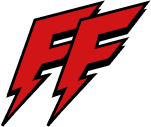</td>
  </tr>
</table>

**신뢰 기반 공연/페스티벌 동행 매칭 플랫폼**

> "함께가는 공연, 더 안전하게"  
> 리뷰 시스템을 통한 신뢰도 확보와 실시간 채팅으로 안전하고 즐거운 공연 동행을 만들어갑니다.

<table>
  <tr>
    <td>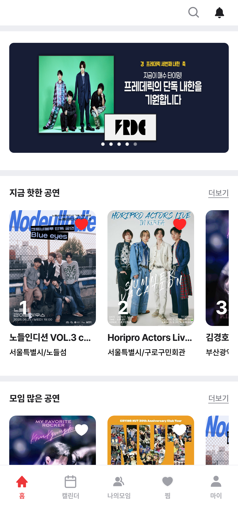</td>
    <td>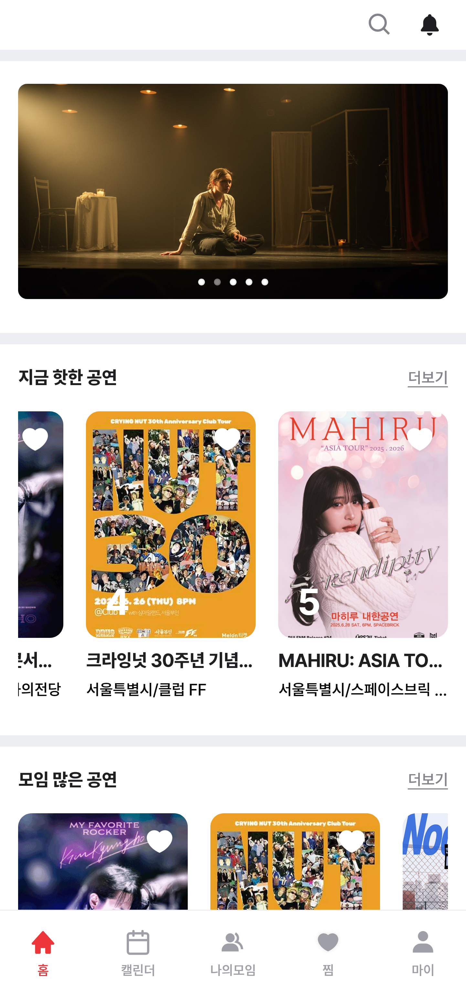</td>
    <td>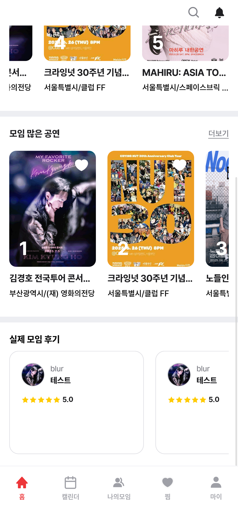</td>
  </tr>
</table>

## 목차

- [팀 구성](#팀-구성)
- [프로젝트 개요](#프로젝트-개요)
- [주요 기능](#주요-기능)
- [기술 스택](#기술-스택)
- [프로젝트 구조](#프로젝트-구조)
- [핵심 구현 사항](#핵심-구현-사항)
- [반응형 디자인](#반응형-디자인)
- [테스트](#테스트)

## 팀 구성

### Frontend 개발

**[고성인](https://github.com/rhtjddls123)**, **[송지현](https://github.com/songdaramji)**, **[임찬호](https://github.com/CHAN-H0)**, **[정유진](https://github.com/jadewisemann)**, **[지서경](https://github.com/Seokyung)**

### Backend 개발

**[박성민](https://github.com/dnjsals45)**, **[이정우](https://github.com/JWbase)**

### Design

**[반수정]()**

## 프로젝트 개요

### 핵심 아이디어

공연 동행의 딜레마인 **경제적 이익**과 **안전성** 사이의 균형을 해결하기 위해 리뷰 시스템과 실시간 채팅을 통한 신뢰 기반 매칭 플랫폼을 구축했습니다.

### 해결하고자 하는 문제

- 혼자 가기엔 아쉽고, 모르는 사람과 가기엔 불안한 공연 관람
- 공연 티켓의 높은 가격 부담
- 동행자의 신뢰성 검증 어려움

### 솔루션

- **리뷰 시스템**: 동행 후 상호 평가를 통한 신뢰도 확보
- **실시간 채팅**: WebSocket 기반 즉시 소통
- **상세 필터링**: 연령대, 성별, 관심사 기반 맞춤 매칭

## 주요 기능

### 공연 탐색 & 검색

- **무한 스크롤**: Intersection Observer 기반 성능 최적화
- **다중 필터링**: 지역, 날짜, 카테고리별 정렬
- **실시간 검색**: 공연명, 장소 기반 즉시 검색

<!-- 공연 목록 페이지 스크린샷 -->

<table>
  <tr>
    <td>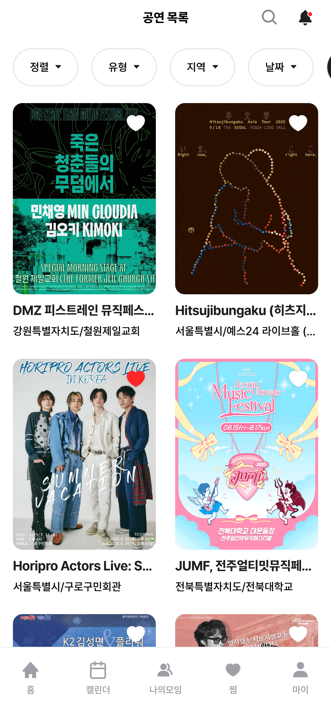</td>
    <td>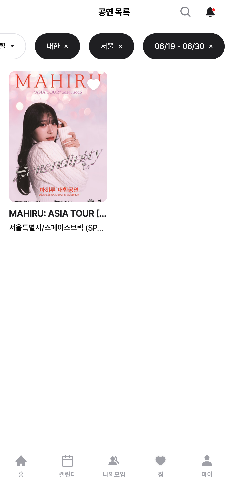</td>
    <td>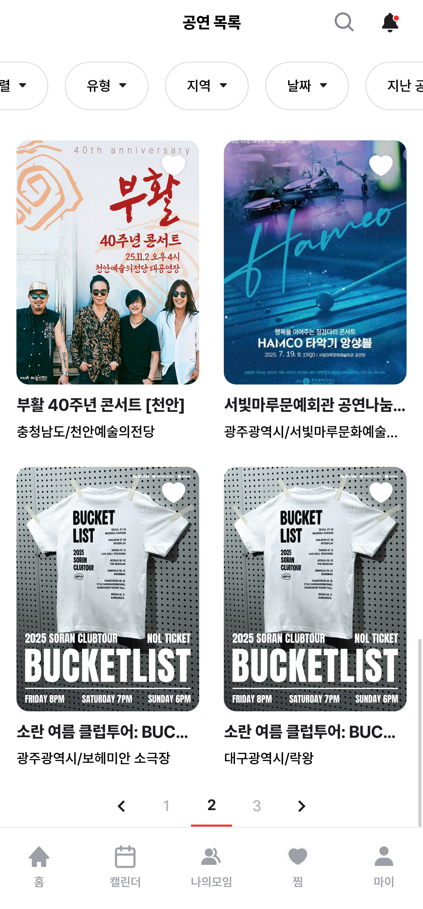</td>
  </tr>
</table>

### 그룹 매칭 시스템

- **그룹 생성**: 상세한 조건 설정으로 원하는 동행자 모집
- **스마트 매칭**: 연령대, 성별, 관심사 기반 추천
- **신청 관리**: 그룹장의 멤버 승인/거절 시스템

<!-- 그룹 생성 페이지 스크린샷 -->
<table>
  <tr>
    <td>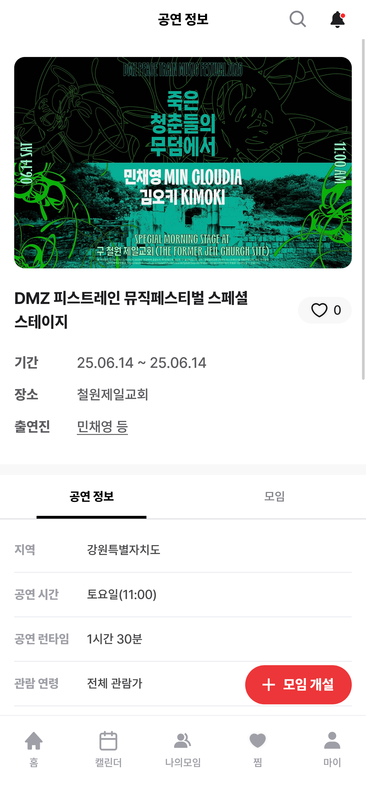</td>
    <td>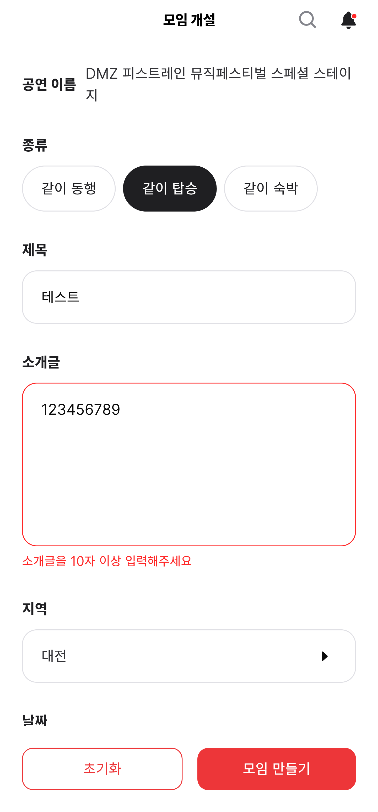</td>
    <td>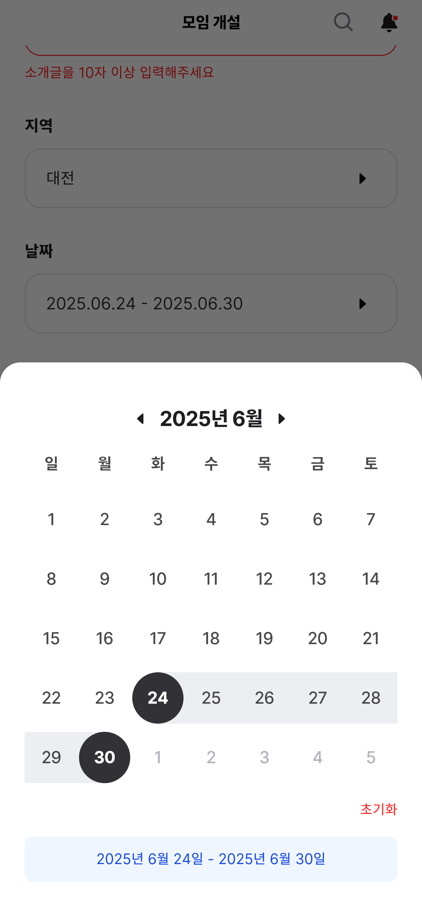</td>
  </tr>
</table>

### 💬 실시간 채팅

- **WebSocket 기반**: STOMP + SockJS를 활용한 안정적 연결
- **그룹별 채팅방**: 다중 그룹 동시 참여 지원
- **메시지 히스토리**: HTTP API와 WebSocket 데이터 통합

<!-- 채팅 화면 스크린샷 -->

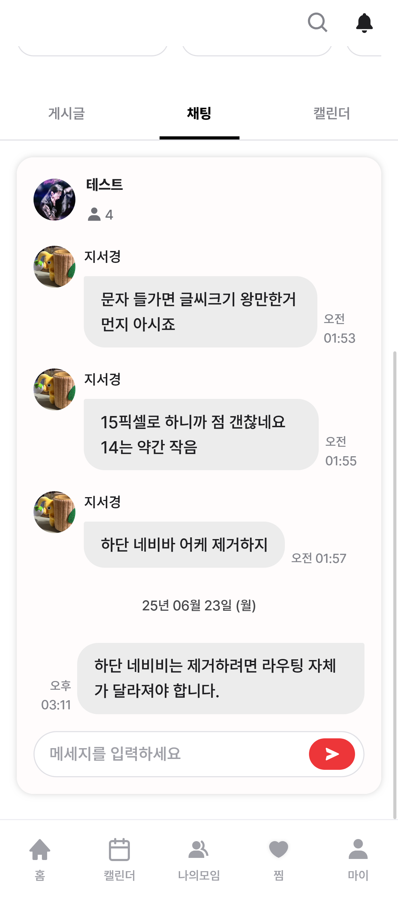

### ⭐ 신뢰도 시스템

- **상호 리뷰**: 동행 후 양방향 평가
- **성향별 태그**: 시간 준수, 친화력 등 세분화된 평가
- **신뢰도 지표**: 평점과 리뷰 수 기반 객관적 표시

<!-- 프로필 페이지 스크린샷 -->

<table>
  <tr>
    <td>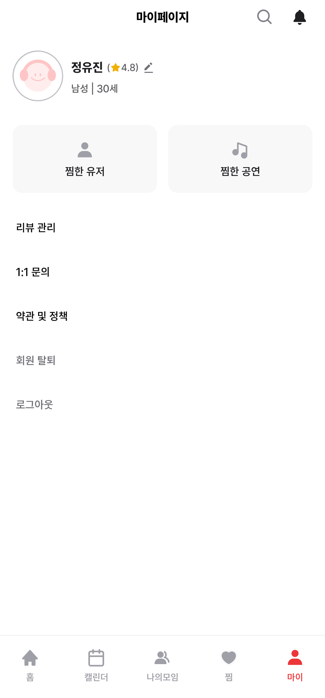</td>
    <td>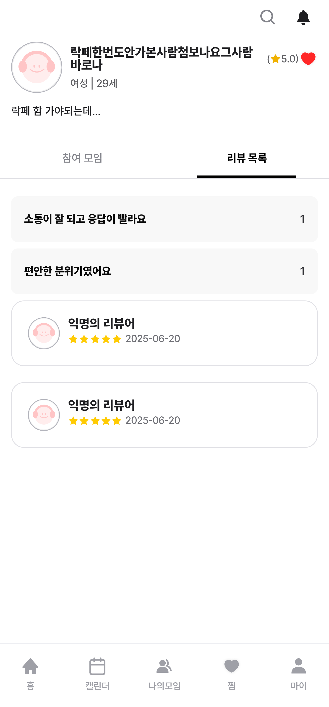</td>
    <td>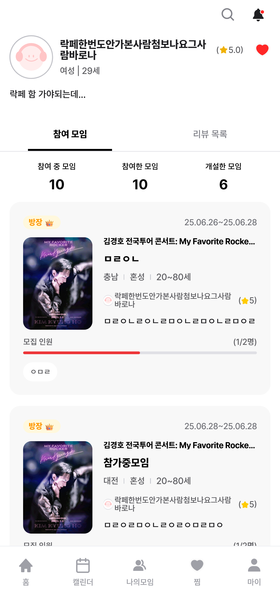</td>
  </tr>
</table>

### 📅 일정 관리

- **그룹 캘린더**: 공유 일정 관리
- **개인 캘린더**: 참여 중인 공연 일정 통합 관리
- **알림 시스템**: SSE 기반 실시간 알림

<!-- 캘린더 페이지 스크린샷 -->

<table>
  <tr>
    <td>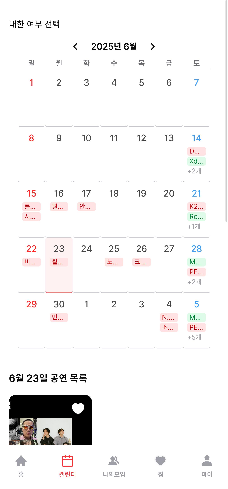</td>
    <td>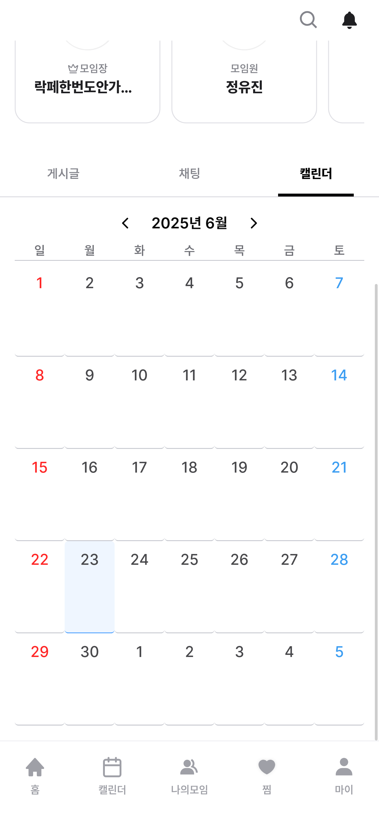</td>
    <td>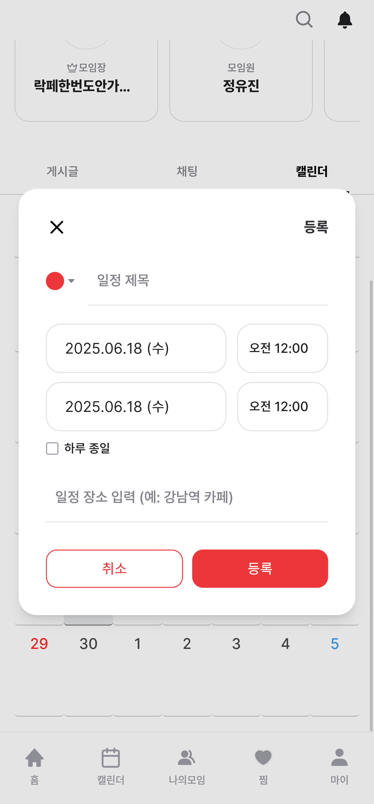</td>
  </tr>
</table>

## 기술 스택

### Frontend Core

```json
{
  "next": "15.3.2",
  "react": "19.0.0",
  "typescript": "5.7.3",
  "@tailwindcss/postcss": "4.0.0-alpha.42"
}
```

**선택 이유**:

- **Next.js 15**: App Router와 Server Components 활용
- **React 19**: 최신 React 기능 적극 활용
- **TypeScript**: 타입 안전성 및 개발 생산성 확보
- **TailwindCSS 4**: 유틸리티 기반 일관된 스타일링

### 상태 관리 & 데이터

```json
{
  "zustand": "5.0.5",
  "@tanstack/react-query": "5.76.1",
  "axios": "1.9.0"
}
```

**아키텍처**:

- **Zustand**: 경량 클라이언트 상태 관리
- **TanStack Query**: 서버 상태 캐싱 및 동기화
- **Axios**: HTTP 클라이언트 및 인터셉터

### 개발 도구 & 품질 관리

```json
{
  "jest": "29.7.0",
  "@testing-library/react": "16.3.0",
  "msw": "2.8.4",
  "eslint": "9.19.0",
  "prettier": "3.5.3",
  "husky": "9.1.7"
}
```

**품질 보장**:

- **Jest + Testing Library**: 단위/통합 테스트 (커버리지 70%+)
- **MSW**: API 모킹으로 독립적 개발
- **ESLint + Prettier**: 코드 품질 및 스타일 통일
- **Husky**: Git Hook 기반 자동화

### 실시간 통신

```json
{
  "@stomp/stompjs": "7.0.0",
  "sockjs-client": "1.6.1"
}
```

**실시간 기능**:

- **WebSocket**: 그룹 채팅
- **SSE**: 실시간 알림

## 프로젝트 구조

```
src/
├── app/                    # Next.js App Router
│   ├── (hasGNB)/          # GNB가 있는 레이아웃
│   │   ├── (isLogin)/     # 로그인 필요 페이지
│   │   └── page.tsx       # 메인 페이지
│   ├── globals.css        # 전역 스타일
│   └── layout.tsx         # 루트 레이아웃
├── components/            # UI 컴포넌트
│   ├── common/           # 범용 UI 컴포넌트
│   │   ├── Button/       # 기본 버튼
│   │   ├── Modal/        # 모달 시스템
│   │   ├── InfiniteList/ # 무한 스크롤 컴포넌트
│   │   └── ...
│   ├── pages/            # 페이지 특화 컴포넌트
│   │   ├── groupDetail/  # 그룹 상세 (채팅 포함)
│   │   ├── performances/ # 공연 목록
│   │   └── ...
│   └── icons/            # SVG 아이콘
├── hooks/                # 커스텀 훅
│   ├── chatHooks/        # 채팅 관련 훅
│   ├── useInfiniteScroll/# 무한 스크롤 훅
│   ├── useDragScroll/    # 드래그 스크롤 훅
│   └── ...
├── services/             # API 통신
│   ├── chatService.ts    # 채팅 API
│   ├── groupsService.ts  # 그룹 API
│   └── ...
├── stores/               # 전역 상태
│   ├── authStore.ts      # 인증 상태
│   └── sseStore.ts       # SSE 연결 상태
├── types/                # 타입 정의
│   ├── api.ts           # API 공통 타입
│   ├── chat.ts          # 채팅 타입
│   └── ...
└── utils/                # 유틸리티 함수
    ├── date.ts          # 날짜 처리
    └── ...
```

### 설계 원칙

- **도메인 기반 구조**: 기능별로 명확히 분리
- **재사용성 우선**: 공통 컴포넌트 중심 설계
- **타입 안전성**: 모든 레이어에서 TypeScript 활용

## 핵심 구현 사항

### 실시간 채팅 시스템

**STOMP + SockJS 기반 WebSocket 연결**:

```typescript
// hooks/chatHooks/chatHooks.ts
export const useChatWebSocket = (userId: number, chatRoomId: number) => {
  const clientRef = useRef<Client | null>(null);
  const [isConnected, setIsConnected] = useState(false);

  const connectWebSocket = async (token: string) => {
    const socket = new SockJS(`${WEBSOCKET_URL}/chat`);
    const stompClient = new Client({
      webSocketFactory: () => socket,
      connectHeaders: { Authorization: `Bearer ${token}` },

      onConnect: () => {
        setIsConnected(true);
        // 그룹별 채팅방 구독
        stompClient.subscribe(`/sub/chat/${chatRoomId}`, (message) => {
          const body = JSON.parse(message.body);
          setMessages((prev) => [...prev, body]);
        });
      },

      onStompError: async () => {
        // 토큰 만료 시 자동 갱신 후 재연결
        const newToken = await getNewAccessToken();
        if (newToken) {
          stompClient.deactivate();
          connectWebSocket(newToken);
        }
      },
    });
  };

  return { messages, sendMessage, isConnected };
};
```

**HTTP + WebSocket 데이터 통합**:

```typescript
// components/pages/groupDetail/Chat/ChatArea.tsx
const ChatArea = ({ userId, chatRoomId }: ChatAreaProps) => {
  // WebSocket 실시간 메시지
  const { messages: liveMessages, sendMessage } =
    useChatWebSocket(userId, chatRoomId);

  // HTTP API 채팅 히스토리 (무한스크롤)
  const { data: chatHistory, fetchNextPage } =
    useGetChatHistory(chatRoomId, 20);

  // 히스토리 + 실시간 메시지 병합
  const historyMessages = (chatHistory?.pages ?? [])
    .flatMap(page => page.data ?? [])
    .reverse();

  const allMessages = [...historyMessages, ...liveMessages];

  return (
    <div className="flex h-[60dvh] flex-col">
      <ChatMessageList
        messages={allMessages}
        fetchPrev={fetchNextPage}
      />
      <ChatMessageInput sendMessage={sendMessage} />
    </div>
  );
};
```

### 무한 스크롤 최적화

**Intersection Observer 기반 성능 최적화**:

```typescript
// hooks/useInfiniteScroll/useInfiniteScroll.ts
export const useInfiniteScroll = <T extends HTMLElement>(
  fetchNextPage: () => void,
  hasNextPage: boolean,
  isFetchingNextPage?: boolean
) => {
  const bottomRef = useRef<T | null>(null);

  useEffect(() => {
    if (!bottomRef.current || !hasNextPage || isFetchingNextPage) return;

    const observer = new IntersectionObserver(([entry]) => {
      if (entry.isIntersecting) {
        fetchNextPage();
      }
    });

    observer.observe(bottomRef.current);
    return () => observer.disconnect();
  }, [hasNextPage, fetchNextPage, isFetchingNextPage]);

  return bottomRef;
};
```

**범용 무한 스크롤 컴포넌트**:

```typescript
// components/common/InfiniteList/InfiniteList.tsx
const InfiniteList = <TPage extends { data: TData[] }, TData>({
  options, getDataId, renderData, className,
  emptyFallback, fallback, isFetchingFallback
}: InfiniteListProps<TPage, TData>) => (
  <ErrorBoundary fallback={({ error }) => <p>{error.message}</p>}>
    <Suspense fallback={fallback}>
      <SuspenseInfiniteQuery {...options}>
        {(queryResult) => {
          const bottomRef = useInfiniteScroll<HTMLDivElement>(
            queryResult.fetchNextPage,
            queryResult.hasNextPage,
            queryResult.isFetchingNextPage
          );

          const datas = queryResult.data.pages.flatMap(page => page.data);

          return (
            <>
              <div className={className}>
                {datas.map(data => (
                  <Fragment key={getDataId(data)}>
                    {renderData(data)}
                  </Fragment>
                ))}
              </div>
              <div ref={bottomRef} />
              {queryResult.isFetchingNextPage && isFetchingFallback}
            </>
          );
        }}
      </SuspenseInfiniteQuery>
    </Suspense>
  </ErrorBoundary>
);
```

### 상태 관리 아키텍처

**TanStack Query 서버 상태 관리**:

```typescript
// hooks/groupHooks/groupHooks.ts
export const useGetGroupDetail = (groupId: number) =>
  useQuery({
    queryKey: [GROUP_QUERY_KEY.groupDetail, groupId.toString()],
    queryFn: () => groupsServiceApi.getGroupDetail({ groupId }),
    staleTime: 5 * 60 * 1000, // 5분간 fresh
    gcTime: 10 * 60 * 1000, // 10분간 캐시 유지
  });

export const useJoinGroup = () => {
  const queryClient = useQueryClient();

  return useMutation({
    mutationFn: groupsServiceApi.joinGroup,
    onSuccess: (data, { groupId }) => {
      // 관련된 모든 캐시 무효화
      queryClient.invalidateQueries({
        queryKey: [GROUP_QUERY_KEY.groupDetail, groupId.toString()],
      });
    },
  });
};
```

**Zustand 클라이언트 상태 관리**:

```typescript
// stores/authStore.ts
interface AuthState {
  user: User | null;
  accessToken: string | null;
  setUser: (user: User | null) => void;
  setAccessToken: (token: string | null) => void;
  logout: () => void;
}

export const useAuthStore = create<AuthState>((set) => ({
  user: null,
  accessToken: null,
  setUser: (user) => set({ user }),
  setAccessToken: (accessToken) => set({ accessToken }),
  logout: () => set({ user: null, accessToken: null }),
}));
```

### 타입 안전성 & 검증

**Zod 스키마 기반 폼 검증**:

```typescript
// schema/groupsCreate.ts
export const groupCreateSchema = z.object({
  title: z.string().min(1, '제목을 입력해주세요').max(50),
  description: z.string().min(1, '설명을 입력해주세요').max(500),
  participantLimit: z.number().min(2).max(30),
  ageRange: z
    .object({
      min: z.number().min(10).max(100),
      max: z.number().min(10).max(100),
    })
    .refine((data) => data.min <= data.max, {
      message: '최소 연령이 최대 연령보다 클 수 없습니다',
    }),
  genderRestriction: z.enum(['MALE', 'FEMALE', 'ALL']),
  tags: z.array(z.string()).max(5),
});

export type GroupCreateForm = z.infer<typeof groupCreateSchema>;
```

---

## 반응형 디자인

### 모바일 우선 접근법

**디바이스별 UI 패턴 분기**:

```typescript
// hooks/sizeHook/useIsMobile.tsx
const useIsMobile = () => {
  const isMobile = useMediaQuery({ maxWidth: 768 });
  return IS_MOBILE_IN_DESKTOP || isMobile;
};

// 레이아웃 분기 처리
const Layout = ({ children }) => {
  const isMobile = useIsMobile();

  return (
    <div className="min-h-screen">
      {isMobile && <Header />}        {/* 모바일: 상단 헤더 */}
      {!isMobile && <GlobalNavigationBar />}  {/* 데스크톱: 사이드 GNB */}
      <main>{children}</main>
      {isMobile && <TabBar />}        {/* 모바일: 하단 탭바 */}
    </div>
  );
};
```


**터치 인터랙션 최적화**:

```typescript
// components/pages/PerformanceCalendar/PerformanceHoverCard.tsx
const PerformanceHoverCard = ({ performance }) => {
  const isMobile = useIsMobile();
  const [show, setShow] = useState(false);

  const handleClick = () => {
    if (isMobile) {
      setShow(prev => !prev); // 모바일: 클릭 토글
    }
  };

  const handleEnter = () => {
    if (!isMobile) {
      setShow(true); // 데스크톱: 호버 표시
    }
  };

  return (
    <div
      onClick={handleClick}
      onMouseEnter={handleEnter}
      onMouseLeave={() => !isMobile && setShow(false)}
    >
      <PerformanceCard data={performance} />
      {show && <HoverCard />}
    </div>
  );
};
```

**드래그 스크롤 구현**:

```typescript
// hooks/useDragScroll/useDragScroll.ts
export const useDragScroll = <T extends HTMLElement>(options: {
  direction?: 'horizontal' | 'vertical';
  sensitivity?: number;
}) => {
  const elementRef = useRef<T>(null);
  const isDragging = useRef(false);

  const handleMouseMove = useCallback((e: MouseEvent) => {
    if (!isDragging.current || !elementRef.current) return;

    const deltaX = (startPosition.current.x - e.clientX) * sensitivity;
    elementRef.current.scrollLeft = scrollStart.current.x + deltaX;
  }, []);

  return elementRef;
};
```

---

## 테스트

### 테스트 전략

- **단위 테스트**: 컴포넌트, 훅, 유틸 함수별 검증
- **통합 테스트**: API 통신, 상태 관리 시나리오
- **MSW 모킹**: 독립적인 프론트엔드 테스트 환경

### 테스트 커버리지

```bash
# 테스트 실행
npm run test

# 커버리지 리포트
npx jest --coverage
```

**현재 커버리지**: 70%+ (핵심 로직 80% 이상)

```bash
npx jest --coverage --coverageReporters=text-summary

=============================== Coverage summary ===============================
Statements   : 82.27% ( 10341/12569 )
Branches     : 91.47% ( 837/915 )
Functions    : 66.32% ( 258/389 )
Lines        : 82.27% ( 10341/12569 )
================================================================================

Test Suites: 64 passed, 64 total
Tests:       732 passed, 732 total
Snapshots:   0 total
Time:        22.42 s
```

### 테스트 예시

```typescript
// components/common/Button/Button.test.tsx
describe('Button Component', () => {
  it('renders children correctly', () => {
    render(<Button>Click me</Button>);
    expect(screen.getByRole('button')).toHaveTextContent('Click me');
  });

  it('handles click events', () => {
    const handleClick = jest.fn();
    render(<Button onClick={handleClick}>Click me</Button>);

    fireEvent.click(screen.getByRole('button'));
    expect(handleClick).toHaveBeenCalledTimes(1);
  });

  it('applies variant styles correctly', () => {
    render(<Button variant="primary">Primary Button</Button>);
    expect(screen.getByRole('button')).toHaveClass('bg-blue-500');
  });
});
```

## 개발 도구 & 자동화

### Git Hook 자동화 (by Husky)

```json
// .husky/commit-msg
./node_modules/.bin/commitlint --edit "$1"

// commitlint.config.cjs
module.exports = {
  extends: ["@commitlint/config-conventional"],
  rules: {
    'subject-case': [0],

    // prefix 검증
    "type-enum": [
      2,
      "always",
      [
        "feat",
        "fix",
        "design",
        "refactor",
        "style",
        "docs",
        "test",
        "chore",
        "rename",
        "remove"
      ]
    ]
  }
};

// .husky/pre-push
npm run lint:fix
npm i
npm run test
npm run build

```

### ESLint 설정

```javascript
// eslint.config.mjs

// import ...

const eslintConfig = [
  js.configs.recommended, // JavaScript 기본 권장 설정
  ...tseslint.configs.recommended, // TypeScript 권장 설정들

  {
    files: ['**/*.{js,jsx,ts,tsx}'],

    // setting, plugins ...
    rules: {
      ...react.configs.recommended.rules, // React 기본 권장 규칙들
      ...reactHooks.configs.recommended.rules, // React Hooks 권장 설정
      ...jsxA11y.configs.recommended.rules, // JSX A11y 권장 설정
      ...nextjs.configs.recommended.rules, // Next.js 권장 설정
      ...nextjs.configs['core-web-vitals'].rules,

      /************************ js ************************/
      'no-var': 'error', // var 금지
      'no-new-object': 'error', // 객체 생성자 사용 금지
      'quote-props': ['error', 'as-needed'], // 유효하지 않은 객체 키는 따옴표 사용
      'no-array-constructor': 'error', // new Array() 생성자 사용 금지
      'arrow-body-style': ['error', 'as-needed'], // 화살표 함수는 중괄호 생략 가능
      'prefer-arrow-callback': 'error', // 콜백 선언은 화살표 함수로만
      eqeqeq: ['error', 'always'], // 일치 비교 연산자(===) 강제
      'func-style': ['warn', 'expression'], // 함수는 표현식 형태 권장
      // for...in 비권장, for...of 권장
      'no-restricted-syntax': [
        'error',
        {
          //*..
        },
      ],

      /******************* react & jsx *******************/
      'react/prop-types': 'off', // react prop 검증 건너뛰기 => ts면 필요 없음
      'react/react-in-jsx-scope': 'off', // React 17+ JSX Transform 사용
      'react/jsx-no-target-blank': 'off', // target blank 금지
      'react/jsx-uses-vars': 'error', // JSX에서 변수 사용 시 오류 방지
      // 인라인 함수 지양
      'react/jsx-no-bind': [
        'error',
        {
          // ...
        },
      ],
      // React Fast Refresh, 컴포넌트만 내보내기 허용
      'react-refresh/only-export-components': [
        'warn',
        { allowConstantExport: true },
      ],
      // 컴포넌트는 화살표 함수 또는 함수 표현식 사용
      'react/function-component-definition': [
        'error',
        {
          // ...
        },
      ],

      /******************* typescript *******************/
      '@typescript-eslint/no-unused-vars': ['error'], // 사용하지 않는 변수 금지
      // 헝가리안 케이스 금지
      '@typescript-eslint/naming-convention': [
        'error',
        {
          // ...
        },
      ],

      /******************* prettier *******************/
      'prettier/prettier': [
        'error',
        {
          // ...
        },
      ],

      /******************* import/order *******************/
      'import/order': [
        'error',
        {
          groups: [
            'builtin',
            'external',
            'internal',
            'parent',
            'sibling',
            'index',
            'object',
            'type',
          ],
        },
      ],
    },
  },
];
```

## 성능 최적화

### Core Web Vitals 달성 (실제 측정 데이터 추가 필요)

- **LCP (Largest Contentful Paint)**: < 2.5s
- **FID (First Input Delay)**: < 100ms
- **CLS (Cumulative Layout Shift)**: < 0.1

### 최적화 기법

- **코드 분할**: 페이지별 번들 스플리팅
- **이미지 최적화**: Next.js Image 컴포넌트 활용
- **무한 스크롤**: Intersection Observer 기반 지연 로딩
- **캐싱 전략**: TanStack Query 기반 적극적 캐싱

<!-- 성능 최적화 결과 스크린샷 -->


## 배포 & CI/CD

### 배포 환경

- **개발**: Vercel Preview 배포
- **스테이징**: Vercel Production 배포
- **프로덕션**: 실서비스 환경

## 프로젝트 성과

### 정량적 지표

- **총 커밋 수**: 500+
- **재사용 컴포넌트**: 80+
- **커스텀 훅**: 40+
- **테스트 커버리지**: 70%+
- **주요 페이지**: 15개

### 기술적 성취

- React 19, Next.js 15 등 최신 기술 스택 성공적 적용
- 실시간 채팅 시스템 안정적 구현
- 무한 스크롤 성능 최적화 달성
- 완전한 타입 안전성 확보

## 의존성

### 핵심 프레임워크 및 빌드 도구 (Core Framework & Build Tools)

<div style="display: flex; flex-wrap: wrap; gap: 8px;">
  
  
  
  
</div>

### 📦 데이터 관리 (Data Management)

<div style="display: flex; flex-wrap: wrap; gap: 8px;">
  
  
  
  
</div>

### 🎨 UI 컴포넌트 및 스타일링 (UI Components & Styling)

<div style="display: flex; flex-wrap: wrap; gap: 8px;">
  
  
  
  
  
  
  
  
  
  
</div>

### ⚡️ 애니메이션 및 동적 효과 (Animation & Dynamic Effects)

<div style="display: flex; flex-wrap: wrap; gap: 8px;">
  
  
  
  
  
</div>

### 🧩 폼 및 유효성 검사 (Form & Validation)

<div style="display: flex; flex-wrap: wrap; gap: 8px;">
  
  
  
</div>

### 📡 실시간 통신 및 기타 유틸리티 (Real-time Communication & Utilities)

<div style="display: flex; flex-wrap: wrap; gap: 8px;">
  
  
  
  
  
  
  
  
  
</div>

### 🛠️ 개발 도구 (Development Tools)

<div style="display: flex; flex-wrap: wrap; gap: 8px;">
  
  
  
  
  
  
  
  
  
  
  
  
  
  
  
  
  
  
  
</div>

---

<div align="center">

**Festi Friends**  
_함께가는 공연, 더 안전하게_

Made with ❤️ by FF Team

</div>
